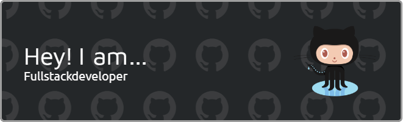

<!-- Hi My name is Abhijit Karmakar -->
<!-- 
Web Developer / Frontend Dev -->

-------------

- I enjoy programming and am keenly interested in learning new languages and technologies. 
- Making web applications is one of my favorite things to do. 
- Currently, I am learning JavaScript, React, and Node JS.
- I am familiar with core languages like C, C++, Java, Python Etc. 
- Now my focus is only on Web Development so I learned Javascript deeply.

* 🌍  I'm based in West Bengal, IN
* ✉️  You can contact me at [akarmakar846@gmail.com](mailto:akarmakar846@gmail.com)
* 🧠  I'm learning Now All about Javascript & Node JS

### Skills

### Core Language Experienced

### Other's

<!-- 

 -->

### Socials

     

### Stats

<!-- - 👋 Hi, I’m @Abhijit47
- 💻 I know these languages C, Java, Python.
- 👀 I’m interested in ... Python,JavaScript,HTML5,CSS3
- 🌱 I’m currently learning ... JavaScript ,HTML5, CSS3, PHP, React, jQuery,VB. Net.
- 💞️ I’m looking to collaborate with the developer to work efficiently and effectively to achieve the best results for the project.
- 📫 How to reach me ... akarmakar846@gmail.com
- I love coding and am very interested in learning new languages, new technologies.
- I think every problem has a solution.
- I never panic when I get into trouble.
- I think the problem should be solved with a cool head because it is not possible to solve the problem with a hot head. -->
<!---
Abhijit47/Abhijit47 is a ✨ special ✨ repository because its `README.md` (this file) appears on your GitHub profile.
You can click the Preview link to take a look at your changes.
---
